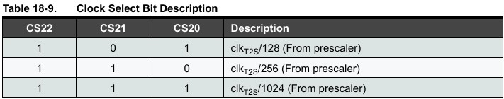

# 8 bit blink
[Схема на Tinkercad](https://www.tinkercad.com/things/dKGxkUZwgZo-8bitblink?sharecode=qyRTFIw2-4HG2EBmSWl0b8OZ0_u89TfjED15If3koSU)

[Код в репозитории](./8bit_blink.ino)

8-битный таймер обновляется каждые 256 циклов, максимально возможный период достижим с prescaler 1024 (**CS22 CS21 CS20**, см. таблицу **Table 18-9.**), с ним таймер будет переполняться каждые 256 * 1024 / 16 000 мс = 16,384 мс.

# Millis
[Схема на Tinkercad](https://www.tinkercad.com/things/7UY7TcyGb64-analogread)

[Код в репозитории](./millis.ino)

# 3 вида blink в одной программе
[Схема на Tinkercad](https://www.tinkercad.com/things/1oBYgsIdvWf-3blinktypes?sharecode=sQgmVhkorHNaVRntxQrZIQFu_9m09T53ZqBb_agz8XI)

[Код в репозитории](./3_blink_types.ino)

# Опрос аналогового пина раз в 250 ms
[Схема на Tinkercad](https://www.tinkercad.com/things/7UY7TcyGb64-analogread?sharecode=OAAF2v6KQ-2Nss3h5jKdoRRdfWuVOSJVWyqNuJ5PvCo)

[Код в репозитории](./analog_read.ino)