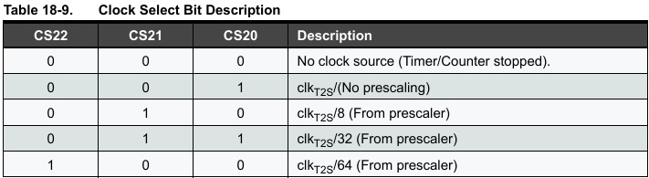
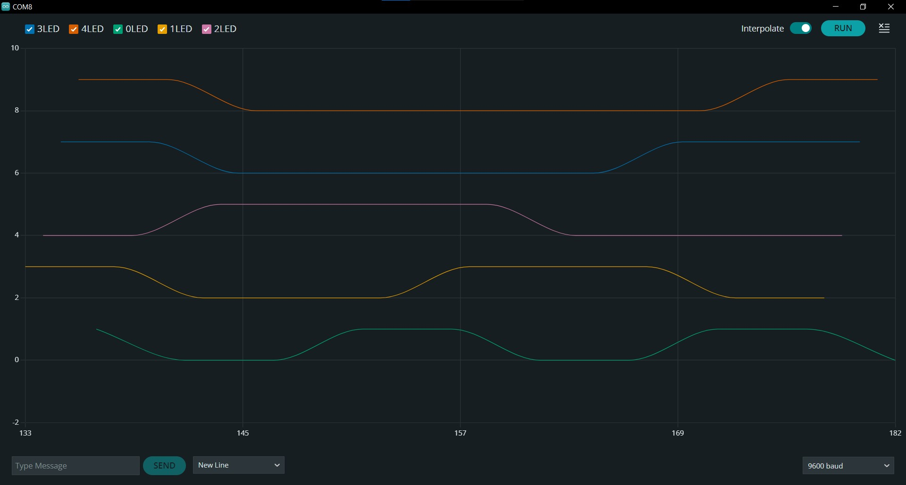

# Ссылки
[Схема на Tinkercad](https://www.tinkercad.com/things/4okKmHNYEo7-led-cascade?sharecode=Ieq4EkwoN5TP6ge964X3k9pEd8JY-anvFfNmc5Cqr9s)\
[Видеодемонстрация](https://drive.google.com/file/d/1C7HXO8WQBCnrbadmoY1bH1IrhGsCX_uD/view?usp=sharing)

# Инициализация
Прерывания реализованы на 8-битном таймере **Timer2** c prescaler = 64 (**CS22**, см. таблицу **Table 18-9.**). Происходят прерывания каждые 256 * 64 / 16 000 мс = 1,024 мс.


```cpp
#define PINS 5
volatile bool states[PINS] = {false};
volatile unsigned int counters[PINS] = {0};
const unsigned int period = 250;
void setup()
{
  cli();
  for (int pin = 1; pin <= PINS; pin++) {
  	DDRB |= 1 << pin;
  }
  TCCR2A = 0;
  TCCR2B = 0;
  TCCR2B |= 1 << CS22; // 64 prescaler
  TIMSK2 |= 1 << TOIE2; // прерывания по переполнению
  sei();
}
```

# Принцип работы
Для каждого пина хранится счётчик, обновляющийся примерно каждую миллисекунду, а также массив состояний. При достижении счётчиком значения `номер светодиода * базовый период` состояние счётчика заменяется на противоположное, а сам счётчик обнуляется:
```cpp
ISR(TIMER2_OVF_vect) {
  uint8_t new_state = 0;
  for (int i = 0; i < PINS; i++){
  	counters[i]++;
    if (counters[i] > (i+1) * period) {
      counters[i] = 0;
      states[i] = !states[i];
    }
    new_state |= int(states[i]) << i;
  }
  PORTB = new_state;
}

void loop()
{
}
```

Дополнительно я провёл проверку на соответствие принципу, что каждый последующий светодиод светится/выключается на 1 базовый период дольше предыдущего, произведя вывод состояний светодиодов в процессе работы:
